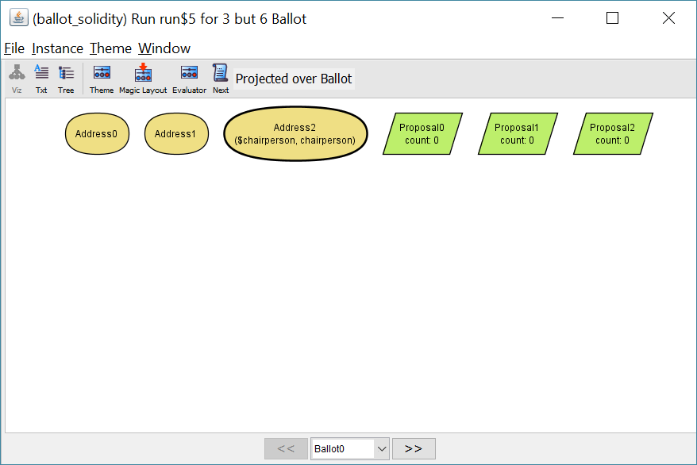
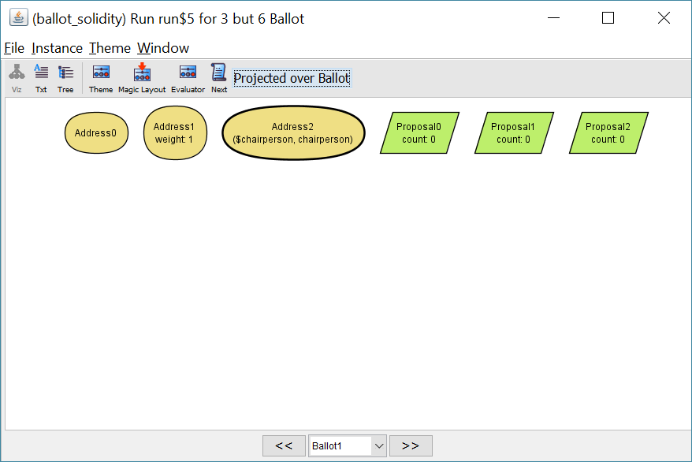
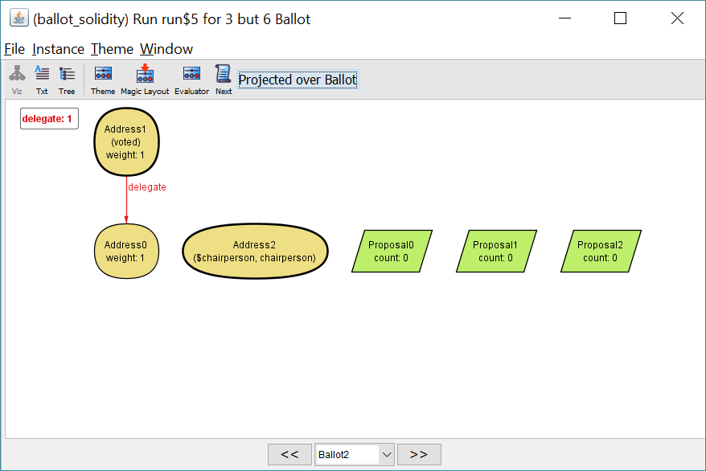
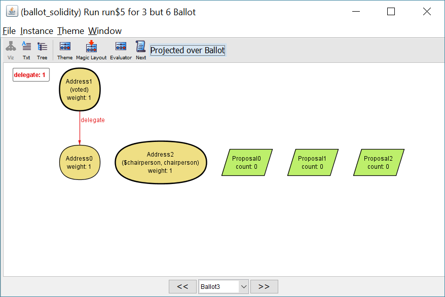
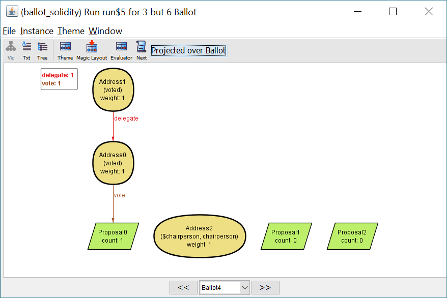
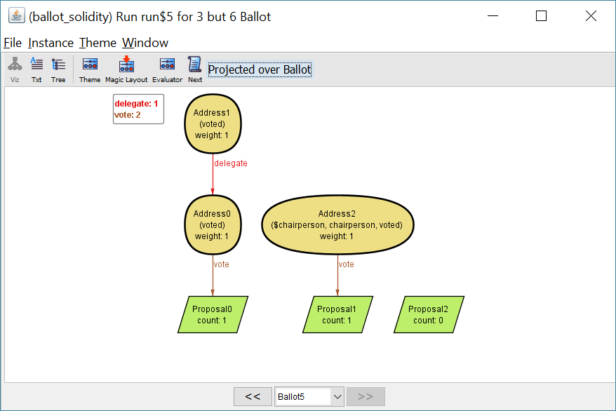

# Validating smart contracts with lightweight formal methods

In Ethereum, smart contracts are account-holding objects on the blockchain.
They contain code and storage, can interact with other contracts, and send and receive "ether"
to and from other accounts (ether is the digital currency used on the Ethereum blockchain).

Ethereum smart contract are immutable and often deal with valuable digital assets.
This gives a strong incentive to get the contract logic right the first time.

## Alloy

[Alloy](http://alloy.mit.edu/alloy/) is a declarative specification language developed by Daniel Jackson and his team at the MIT.
It is well suited to express the logical model underlying
a program. The "Alloy Analyzer" allows the programmer to explore
the model interactively and to check complex logical assertions automatically.

The Alloy approach is considered a "lightweight" method 
because it is intended to provide a fully automated analysis.
Think of it as [property-based testing](https://en.wikipedia.org/wiki/QuickCheck) on steroids.

## Example: Voting

Solidity is the most popular programming language targeting the Ethereum Virtual Machine.
In the Solidity documentation, there is an introductory [example contract](http://solidity.readthedocs.io/en/develop/solidity-by-example.html#voting) for voting.
This contract does not involve money, but it is nevertheless an interesting target for analysis.

Once a voting contract is created by a chairperson (represented by her Ethereum address),
there are three public functions that change the current state. These public functions may, in principle,
be invoked by anyone at anytime.

- `giveRightToVote`:

      // Give `voter` the right to vote on this ballot.
      // May only be called by `chairperson`.
      function giveRightToVote(address voter) public {
          require((msg.sender == chairperson) && !voters[voter].voted && (voters[voter].weight == 0));
          voters[voter].weight = 1;
      }

- `delegate`: let somebody else vote for you
   Everybody can only call this once. Subsequent calls raise an exception.

- `vote`: cast your vote for one of the proposals
   Again, this can only be called once.

The currently leading proposal can be queried by a fourth public function.

For details, please take a look at the [full source code](http://solidity.readthedocs.io/en/develop/solidity-by-example.html#voting). It is well commented.

## Creating the model

Before we can analyze the contract behavior, we need to create a matching Alloy model.
Alloy is a very different language from Solidity.
While Solidity is object-oriented and imperative, Alloy is declarative and feels like a mixture
of logic and functional programming.
Translating the contract can be a worthwile exercise in itself, leading to a deeper understanding
of its behavior.

The gist of the [model](https://github.com/wmeyer/smart-contract-validation/blob/master/voting.als) is explained in the subsequent sections.

### Entities and relationships
There are three kinds of entities we are interested in in this model: addresses, proposals and ballots.
Addresses represent Ethereum addresses. We do not care about the details of addresses. The only
thing that matters is their identity. So we define addresses as an empty signature:

    sig Address {}

Signatures are similar to classes in object-oriented languages. A signature defines a set
of objects and optionally relationships to instances of other signatures.

    sig Proposal {}

The details of proposals also don't matter for our model. The only important thing is that there is
a set of proposals that can be voted on.

    sig Ballot {
      chairperson: Address
      voted: set Address,
      vote: Address -> lone Proposal,
      delegate: Address -> lone Address,
      weight: Address -> lone Int,
      count: Proposal -> one Int
    }

The only non-trivial entity in this model is the ballot. It has a number of relationships that are
used to keep track of the current voting situation. A ballot captures the whole current state.

A ballot has exactly one chairperson. It is the address of the user that created the ballot.
This is equivalent to the `chairperson` field in the Solidity example.

The `voted` set is used to remember which addresses already voted or delegated. 
This set fulfills the same purpose as the `voted` field in the "Voter" struct in Solidity.

`vote` is a relationship from addresses to proposals. Relationships play the same role as mappings or dictionaries in other languages.
The multiplicity of the `vote` relationship is 0..1 as indicated by the `lone` keyword.
Every address can vote for at most one proposal.

`delegate` is similar. It is used to remember who delegated to whom.

`weight` determines how much the vote of an address counts once it is cast. Only addresses that have been
delegated to can have a weight greater than 1.

Finally, `count` is the result of the vote so far. The keyword `one` enforces that every proposal must
have a exactly one current count. Initially the count will be 0 for all proposals.

Compared to the data structure in the Solidity example, our Alloy data structure is flattened.
We could have chosen a nested structure in Alloy, too. But in Alloy, all data is immutable (similar to 
pure functional programming languages), and working with flat structures is easier in this case.

### Transitions

In the initial state of a ballot, all relationships are empty, except for the chairperson which is
set to the address of the contract creator, and the vote count which is initialized to 0
for every proposal.

To define valid transitions from the initial state to subsequent states, we define some predicates.
A predicate contains a sequence of constraints. When a predicate is called, these constraints
are applied to the given parameters. Constraints can never contradict other constraints. As a consequence,
we cannot change any data, we can only add additional information.

For example, to add voting rights for a new voter:

    pred giveRightToVote(sender: Address, b, b': Ballot, voter: Address) {
      // preconditions
      sender = b.chairperson
      voter not in b.voted
      voter not in b.weight.Int  // voter must not have a weight from before

      // copy unchanged relations
      b'.voted = b.voted
      b'.count = b.count
      b'.chairperson = b.chairperson
      b'.delegate = b.delegate
      b'.vote = b.vote

      // add a tuple (voter, 1) to the weight relationship
      b'.weight = b.weight + voter -> 1
    }

The initial state is given as `b`. The new state is returned as `b'`.
This predicate is quite similar to the Solidity example function with the same name.
There are to important differences, though:

1. We need to add some additional code to copy all unchanged fields from `b` to `b'`.
   Otherwise, those fields would be unconstrained in `b'` and would be filled with
   arbitrary values during analysis.
2. In Solidity, we distinguish between assertions, using the `require` keyword, and
   the actual code. In Alloy, on the other hand, the whole predicate consists of constraints.
   There is no difference between requiring a certain state and actively setting the state.
   (As is typical for logic programming languages.)

### Enforcing only legal states

We want to constrain the state space to legal ballots. Only ballots that can be created
from the initial state by applying well-defined transitions should be allowed.

This can be achieved be enforcing an ordering on the set of ballots and defining
the legal transitions:

    open util/ordering[Ballot] as ord

    fact traces {
      // the first state is a freshly created ballot
      some chairperson: Address | freshBallot[chairperson, ord/first]

      // define all legal state transitions
      all b: Ballot - ord/last |
        let b' = b.next |
          (some sender, voter: Address | giveRightToVote[sender, b, b', voter])
          or (some sender, to: Address | delegate[sender, b, b', to])
          or (some sender: Address, prop: Proposal | vote[sender, b, b', prop])
    }

We are using the built-on `ordering` module to impose an ordering on the Ballot instances
and define some "facts". In Alloy, facts are constraints that always hold.

First we define that the first ballot is always a "fresh ballot" created by
some chairperson represented by an address. `freshBallot` is a simple predicate
that initializes the fields. By using an existential quantification of the form

    some chairperson: Address | <constraint>

we ensure that the Alloy Analyzer is free to choose any available `chairperson` when creating examples.

Then, for all ballots except for the last one, we define the relationship between a ballot and its
successor `b.next`.

There are three possible transitions, connected using the `or` keyword:

1. Giving someone the right to vote, using the previously defined predicate `giveRightToVote`.

2. Delegating the vote to somebody else. The definition of the `delegate` predicate is not shown
   here but can be seen in the full listing.

3. Voting for a proposal, using the predicate `vote` (also not shown here).

Again, we use existential quantification, to allow for arbitrary senders, voters and proposals.

## Analysis: Interesting properties

An important property we want for our model is: the sum of all votes can never be greater
than the sum of all weights that were distributed by the chairperson.
It may be smaller when not all votes have been cast yet, but it can never be greater in a legal ballot.

In Alloy, we can express this as an assertion:

    assert sumOfCountsNotMoreThanWeights {
      all b: Ballot |
        let counts = sum p: Proposal | b.count[p] |
        let weights = sum a: Address | b.weight[a] |
        counts <= weights
    }

We can automatically check this assertion with the `check` command.

    > check sumOfCountsNotMoreThanWeights

    Executing "Check sumOfCountsNotMoreThanWeights"
       Sig this/Address scope <= 3
       Sig this/Proposal scope <= 3
       Sig this/Ballot scope <= 3
       Sig this/Ballot forced to have exactly 3 atoms.
       No counterexample found. Assertion may be valid. 203ms.

By default, the Alloy Analyzer chooses a scope of 3, i.e. it analyzes all scenarios with at most 3 adresses, 3 proposals and 3 ballots.
Within this scope, no counterexample has been found.

In this case, the default scope is too small. With only 3 ballots, the scenarios cannot even contain all 3 types of legal transitions!
Let's increase the number of ballots to 6:

    > check sumOfCountsNotMoreThanWeights for 3 but 6 Ballot

    Executing "Check sumOfCountsNotMoreThanWeights for 3 but 6 Ballot"
       Sig this/Address scope <= 3
       Sig this/Proposal scope <= 3
       Sig this/Ballot scope <= 6
       Sig this/Ballot forced to have exactly 6 atoms.
       No counterexample found. Assertion may be valid. 16245ms.

The analysis has taken a lot more time, but still no counterexample has been found.
Of course, we could start an analysis with an even large scope. But that does not seem to be necessary.
It is reasonable to assume that the assertion always holds. 
We rely on the "small scope hypothesis": that a high proportion of bugs can be found by testing a program for all test inputs within some small scope.

Some other assertions that were successfully checked:
- There can never be a voter that has both voted and delegated.
- It does not matter whether we delegate to someone before or after she has voted. (Both cases are handled in `delegate`.)
- There can never be a loop of delegation, i.e. a situation were someone directly or indirectly delegates his vote to himself.
The formal definitions of these assertions can be seen in the full model source.

No problems were found by checking the properties we could think of. The Solidity voting example seems to be pretty solid.

## Interactive exploration

Still, so far we haven't taken a look at any instances of our model. How can we have confidence that our model
actually makes sense?

This is where interactive exploration comes into play. We can tell the Alloy Analyzer to generate example instances
satisfying all model constraints, and we can then explore those instances with a graphical inspector.

Let's take a look at an example. In the initial state "Ballot0", there are three proposals and three addresses. So far nobody has voted yet, in fact, nobody has the right to vote. "Address2" has been selected to be the chairperson: 

"Address1" has been given the right to vote. Her "weight" is now 1: 

"Address1" has delegated her vote to "Address0". She cannot vote again because the address is now in the "voted" set.
"Address0" has received the delegated "weight" 1: 

"Address2" has now also received the right to vote: 

"Address0" has voted for "Proposal0": 

"Address2" has voted for "Proposal1": 

This looks like a reasonable sequence of events. Our model seems to generate meaningful instances. The only slightly suprising
observation is that a vote can be delegated to a person without the right to vote.

## A minor problem with the example contract

When looking at further instances, a curious situation attracts attentions:

TODO
